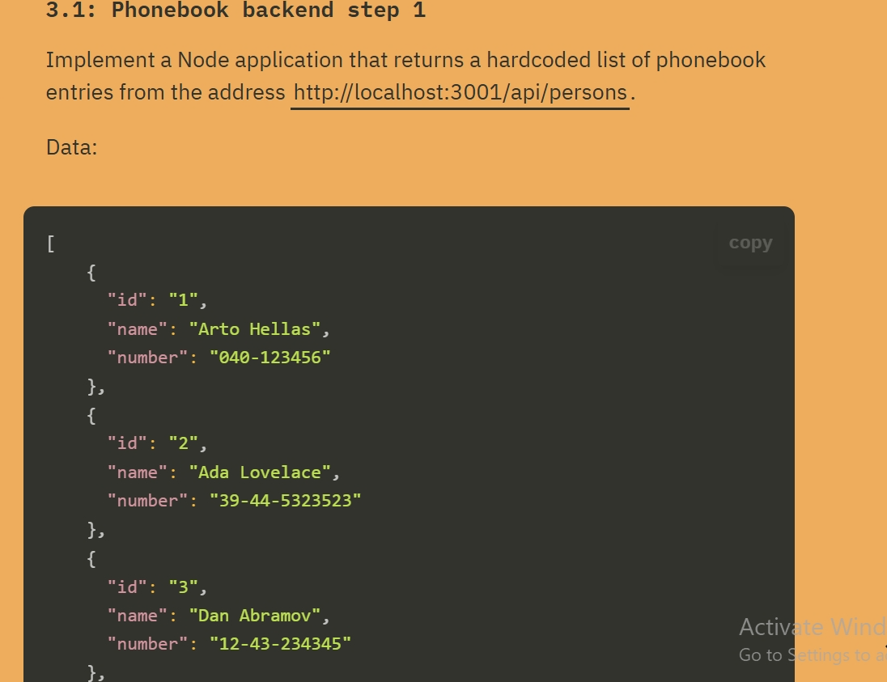
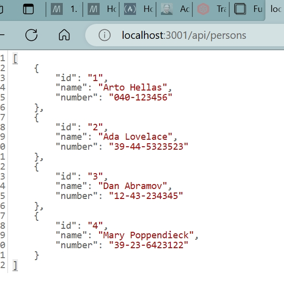
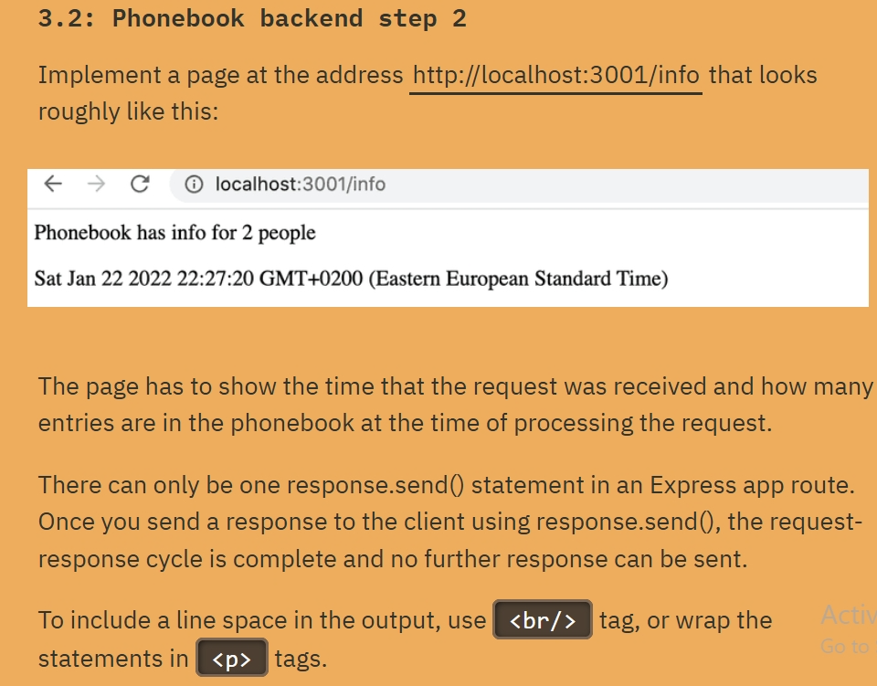
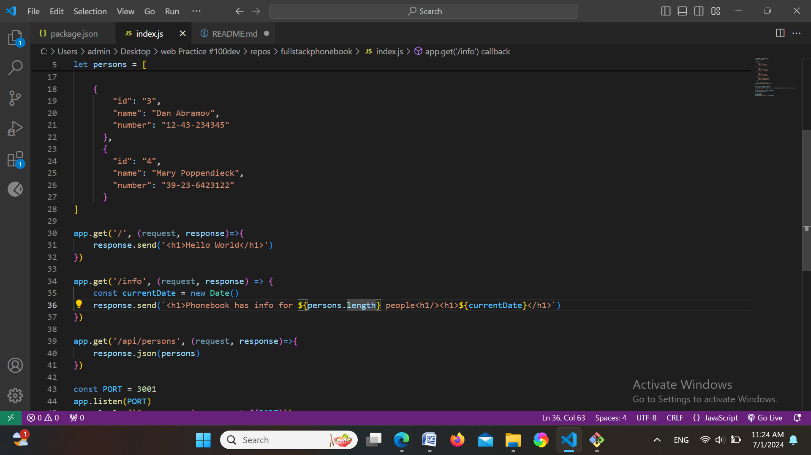
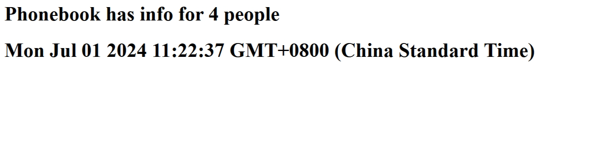
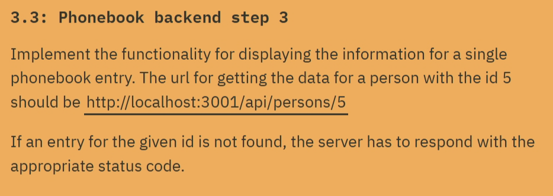
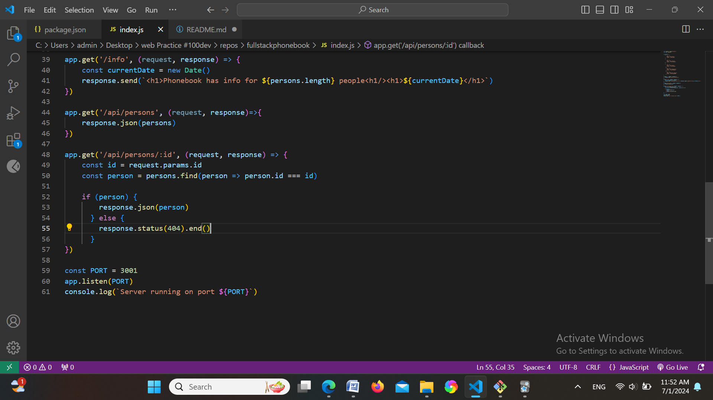
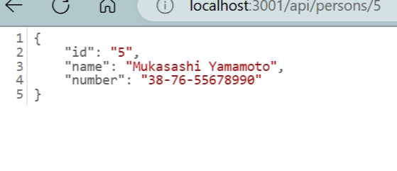
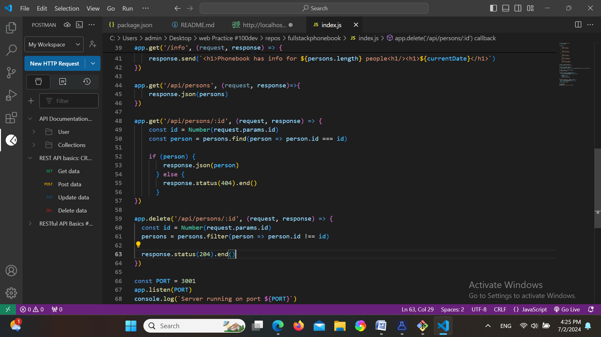
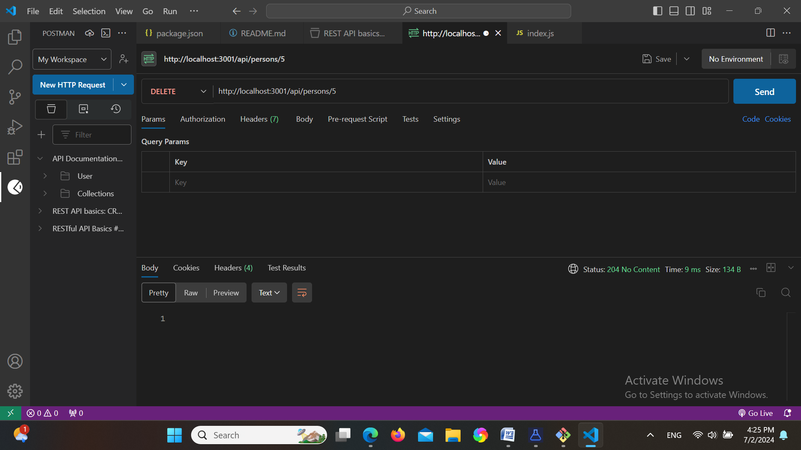

# fullstackphonebook
a Node application that returns a hardcoded list of phonebook entries 

1. completed the first part:
    
   

   

2. completed the second part:
   
   
   

3. completed the third part:
   
   
   

4. completed the fourth part
   
   

